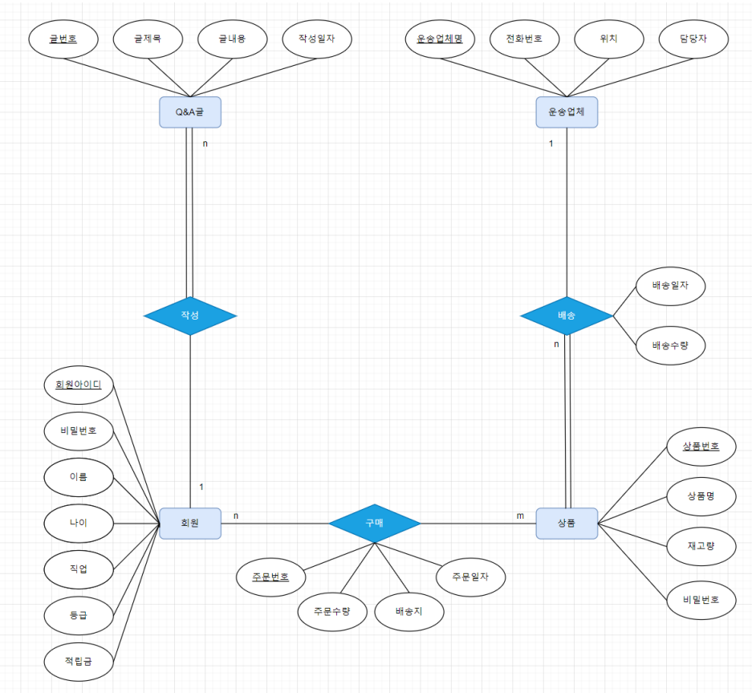
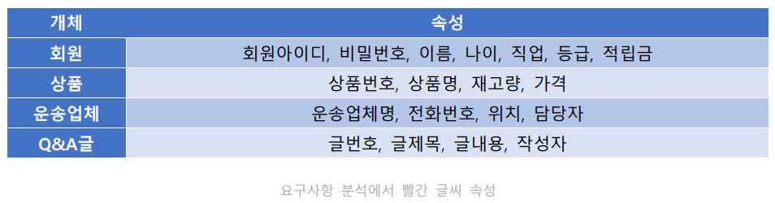
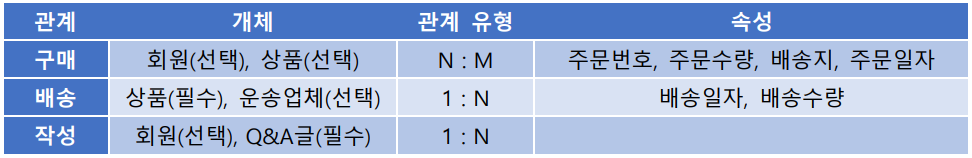

# 쇼핑몰 DataBase 프로그램

## 1. 요구사항 분석
###### A 쇼핑몰에 관한 데이터베이스 요구사항 분석
1. A 쇼핑몰에 회원으로 가입하려면 회원아이디, 비밀번호, 이름, 나이, 직업을 입력해야 한다.
2. 가입한 회원에게는 등급과 적립금이 부여된다.
3. 회원은 회원 아이디로 식별한다.
4. 상품에 대한 상품번호, 상품명, 재고량, 가격을 유지해야 한다.
5. 상품은 상품번호로 식별한다.
6. 회원은 여러 상품을 구매할 수 있으며, 하나의 상품을 여러 회원이 구매할 수도 있다.
7. 회원이 상품을 주문하면 주문은 주문번호, 주문수량, 배송지, 주문일자 정보를 유지해야 한다.
8. 각 상품은 한 운송업체가 배송하고, 운송업체 하나는 여러 상품을 배송할 수 있다.
9. 운송업체가 상품을 배송하면 배송일자와 배송수량 정보를 유지해아 한다.
10. 운송업체에 대한 운송업체명, 전화번호, 위치, 담당자 정보를 유지해야 한다.
11. 운송업체는 운송업체명으로 식별한다.
12. 회원은 여러 개의 Q&A글을 작성할 수 있고, Q&A글은 하나는 한 명의 회원만 작성할 수 있다.
13. Q&A글에 대한 글번호, 글제목, 글내용, 작성일자 정보를 유지해야 한다.
14. Q&A글은 글번호로 식별한다

## 2. 개념 모델링 : ER 다이어그램

6. 회원은 여러 상품을 구매할 수 있으며, 하나의 상품을 여러 회원이 구매할 수도 있다.
- 관계 : 구매 / 다대 다 관계
7. 회원이 상품을 주문하면 주문은 주문번호, 주문수량, 배송지, 주문일자 정보를 유지해야
한다.
- 속성 : 주문번호, 주문수량, 배송지, 주문일자
8. 각 상품은 한 운송업체가 배송하고, 운송업체 하나는 여러 상품을 배송할 수 있다.
- 관계 : 배송 / 일대다 관계
9. 운송업체가 상품을 배송하면 배송일자와 배송수량 정보를 유지해아 한다.
- 속성 : 배송일자, 배송수량
12. 회원은 여러 개의 Q&A글을 작성할 수 있고, Q&A글은 하나는 한 명의 회원만 작성할 수
있다.
- 관계 : 작성 / 일대다 관계
- 속성 : X

## 3. 논리 모델링 : 테이블 정의서
- 회원 릴레이션 (회원아이디, 비밀번호, 이름, 나이, 직업, 등급, 적립금)
- 상품 릴레이션 (상품번호, 상품명, 재고량, 단가, 운송업체명(FK), 배송일자, 배송량)
- 운송업체 릴레이션 (운송업체명, 전화번호, 위치, 담당자)
- Q&A글 릴레이션 (글번호, 글제목, 글내용, 작성일자, 회원아이디(FK))
- 주문 릴레이션 (회원아이디, 상품번호, 주문번호, 주문수량, 배송지, 주문일자
